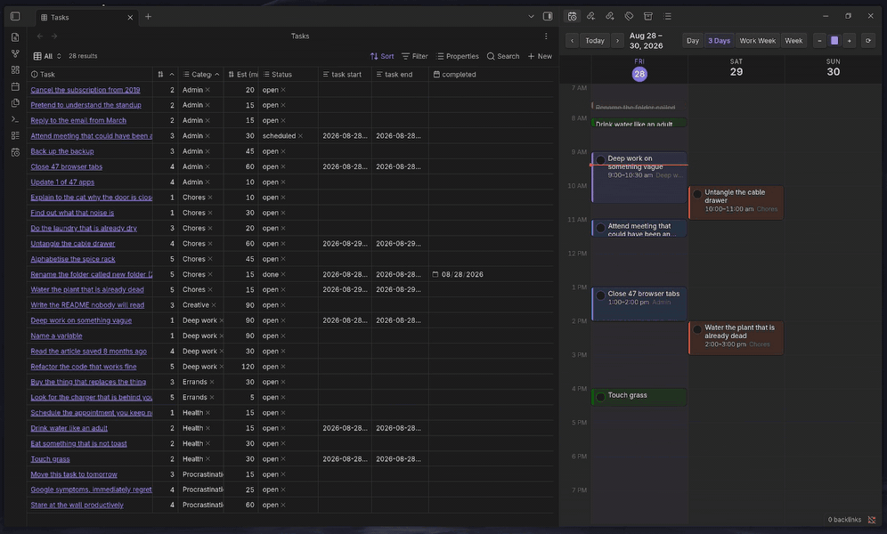

# Task Calendar

[](LICENSE)
[](manifest.json)
[](https://obsidian.md)
[](https://donate.stripe.com/5kQcN4eN5bvOcVX317f7i00)

A drag-and-drop day planner for Obsidian that schedules real notes. It will not
do the tasks for you. Nothing will do the tasks for you. That is the one feature
everybody wants and the one feature nobody ships.



<sub>Dragging real notes onto real time. The tasks are fictional. The
avoidance is not.</sub>

Every task is a note in one folder, surfaced through one **Base**. You drag a row
from that Base onto a calendar grid and it becomes a scheduled block. No checkbox
lines, no `- [ ] 09:00 - 10:00` strings scattered across a hundred daily notes —
the note's frontmatter is the only source of truth, and the grid is just a view
of it.

> Requires Obsidian **1.9.0+** (Bases). Desktop only, because dragging a
> 30-minute block onto a phone screen is a fine way to schedule something for
> next March.

---

## Why this exists

Most Obsidian task workflows spread state across the vault: a checkbox here, a
`⏳ 2026-03-04` there, a daily-note time block somewhere else. Reschedule
something and you are hand-editing three files and hoping the regexes agree.
They do not agree. They have never agreed.

Task Calendar inverts that. One folder of task notes. One Base to filter and sort
them. One grid to place them on. Move a block and the plugin rewrites two
frontmatter fields — that is the entire write path, so it is always
round-trippable and never mangles your prose.

Fewer moving parts means fewer things that can quietly go wrong at 11pm while
you are planning tomorrow instead of sleeping.

---

## Features

- **Drag from a Base onto the grid.** Any Bases row that resolves to a note
  becomes draggable; drop it on a time slot to schedule it.
- **Drag, resize, and move blocks** already on the grid, with configurable snap
  (default 15 minutes) — for when you decide that thing is *actually* going to
  take two hours.
- **Drag on empty space to create** a brand-new task note, or search-and-attach
  an existing unscheduled one from the same dialog. Both paths end in a real
  note, not a floating string.
- **Day / 3-day / work-week / week** views, zoom, and a fit-the-day-to-the-window
  toggle. The week view is included for people who enjoy being confronted.
- **Read-only ICS calendar feeds** (Google Calendar, Fastmail, anything that
  serves iCal) painted behind your tasks, so you can plan around the meetings
  that were going to happen with or without your consent.
- **Alarms** with a lead time, a custom sound, and optional system
  notifications. They fire whether or not the planner view is open, which is
  the entire point of an alarm and yet somehow a differentiator.
- **Category colours** from a palette validated all-pairs for contrast in light
  and dark, including colour-vision-deficient pairs. Someone ran the numbers.
  That someone was me, and I would like you to know it took a while.
- **Right-click a block** to open the note, mark it done, change duration, push
  it to tomorrow, push it to next week, push it to next week again, or
  unschedule it and pretend the whole thing never happened.
- **Auto status.** Scheduling sets a status; ticking a block writes `done` and a
  completion date, so your Done view fills up and you feel briefly excellent.

---

## Install

### From Obsidian (recommended)

**Settings → Community plugins → Browse**, search for **Task Calendar**, install,
enable. Done. This is also how you get updates without thinking about it.

### From a release

1. Download `main.js`, `manifest.json`, and `styles.css` from the
   [latest release](https://github.com/spencerframe/obsidian-task-calendar/releases/latest).
2. Drop them into `<your vault>/.obsidian/plugins/task-calendar/`.
3. In Obsidian: **Settings → Community plugins → Reload**, then enable
   **Task Calendar**.

### With BRAT

Install [BRAT](https://github.com/TfTHacker/obsidian42-brat), then
**Add beta plugin** → `spencerframe/obsidian-task-calendar`.

### From source

There is no build step. There is no bundler, no config file, no `postinstall`
script that downloads a second package manager. It is one JavaScript file.

```bash
git clone https://github.com/spencerframe/obsidian-task-calendar \
  "<your vault>/.obsidian/plugins/task-calendar"
```

---

## Quick start

### 1. Make a task folder

Create a folder — `tasks/` by default — and put one note in it per task. The
filename is the task title. This is the whole schema negotiation.

### 2. Give task notes this frontmatter

```yaml
---
task start:
task end:
category:
  - Deep work
status:
  - open
priority: 3
estimate: 90
---
```

Leave `task start` and `task end` empty. The plugin fills them in when you drop
the task on the grid. Filling them by hand also works, if you are the kind of
person who alphabetises their spice rack.

| Property     | Type              | What it does                                                                 |
| ------------ | ----------------- | ---------------------------------------------------------------------------- |
| `task start` | date-time         | **The one field that matters.** A task with a parseable start is scheduled.    |
| `task end`   | date-time         | End of the block. Falls back to `estimate`, then to the default duration.      |
| `estimate`   | number (minutes)  | Used as the block length when there is no `task end`. Optimistic by tradition. |
| `category`   | text or list      | Drives the block colour and groups your Base.                                  |
| `status`     | text or list      | `done` anywhere in it hides or dims the task, depending on your settings.      |
| `priority`   | number 1–5        | Shown as `P1`–`P5` on the block. Everything is P1. It's fine.                  |
| `completed`  | date              | Written automatically when you tick a block.                                   |

Accepted date-time shapes: `YYYY-MM-DD HH:mm`, `YYYY-MM-DDTHH:mm`, with optional
seconds, plus bare `YYYY-MM-DD`. Every property name is configurable in settings
if your vault already uses different keys, because of course it does.

### 3. Create the Base

Make a `.base` file anywhere in the vault. A minimal one:

```yaml
filters:
  and:
    - file.inFolder("tasks")
views:
  - type: table
    name: Unscheduled
    filters:
      and:
        - note["task start"].isEmpty()
        - status.contains("done") == false
    order:
      - priority
      - file.name
      - category
      - estimate
  - type: table
    name: Scheduled
    filters:
      and:
        - note["task start"].isEmpty() == false
    order:
      - file.name
      - task start
      - task end
      - category
```

Keep the **Unscheduled** view open next to the planner. It is your drag source,
and rows vanish from it as you place them, which is the closest this plugin gets
to a dopamine loop.

### 4. Open the planner and drag

Click the calendar-clock ribbon icon, or run **Task Calendar: Open calendar** from
the command palette. Put the Base in one pane and the planner in another, then
drag rows across. That's the app.

---

## Using the grid

| Gesture                          | Result                                                         |
| -------------------------------- | -------------------------------------------------------------- |
| Drag a Base row onto a slot      | Schedules that note at the drop time                            |
| Drag on empty grid space         | Opens the new-task dialog with that span pre-filled             |
| Drag a block                     | Moves it; snaps to the configured interval                      |
| Drag a block's top/bottom edge   | Resizes the start or end                                        |
| Click the tick circle            | Marks done and stamps the completion date                       |
| Right-click a block              | Open note · mark done · duration · move to · unschedule         |
| `‹` `›` / **Today**              | Navigate; the step follows the current view mode                |
| `−` `+` / fit button             | Zoom the hour height, or fit the whole day to the pane          |

In the new-task dialog you can either type a title to create a note, or search
for an existing unscheduled task and attach it to the span you just drew. The
second option is how you finally schedule the thing from four months ago.

---

## Calendar feeds

**Settings → Task Calendar → Calendars → Feeds → Add.** Paste an ICS URL and pick
a colour, or map the feed to a category so it inherits that category's colour.

In Google Calendar the URL you want is under
**Settings → the calendar → "Secret address in iCal format"**.

That URL is a password wearing a URL costume. Anyone holding it can read the
calendar forever, and it does not expire. It lives in the plugin's `data.json`,
which is why this repo `.gitignore`s that file, and why you should think for a
solid three seconds before zipping up your plugin folder and sending it to a
friend. Ask me how I know.

Feeds refresh every 10 minutes, or on demand via the `⟳` button and the
**Refresh calendars** command.

---

## Alarms

Alarms run from the plugin, not the view, so closing the planner does not
silence them. This is a feature. You will not agree at 6:45am.

Configure the lead time, volume, a custom sound file, and whether alarms fire
for calendar events, scheduled tasks, or both. **Test the alarm sound** in the
command palette plays one immediately, so you can find out how loud it is on
your terms rather than during a meeting.

---

## Settings reference

| Group          | Settings                                                                                     |
| -------------- | -------------------------------------------------------------------------------------------- |
| **Tasks**      | Task folder · property names · use estimate as duration · default duration · auto status · show completed |
| **Grid**       | Day start/end hour · snap minutes · row height (px per hour) · fit to window · first day of week |
| **Categories** | Per-category colours, rescan categories                                                       |
| **Alarms**     | Enable · lead time · events/tasks · volume · custom sound · system notification               |
| **Calendars**  | Show events · feeds (name, ICS URL, colour or category)                                        |

---

## Commands

| Command                  | What it does                                       |
| ------------------------ | -------------------------------------------------- |
| `Open calendar`          | Opens or focuses the planner view                  |
| `Refresh calendars`      | Force-refetches every enabled ICS feed             |
| `Test the alarm sound`   | Fires a dummy alarm                                |
| `Diagnose drag and drop` | Writes `task-planner-diagnostics.md` for bug reports |

---

## Troubleshooting

**Bases rows will not drag.** Bases' internal markup changes between Obsidian
releases, so the plugin matches a family of plausible row selectors rather than
betting everything on one. Run **Diagnose drag and drop** and open the report it
writes — it lists which selectors matched and which other drag-related plugins
are active. Attach it to an issue instead of describing the problem as "it
doesn't work," which, while true, is not actionable.

**A drop lands on the wrong day.** Check that `task start` parses: it must begin
with `YYYY-MM-DD`. A bare number is rejected on purpose. Without that guard, a
mistyped `task start: 60` gets read as the year 2060 and your task politely
removes itself from your life for thirty-four years.

**Tasks do not appear at all.** Confirm the note is inside the configured task
folder and that `task start` is non-empty. Notes without a start are unscheduled
by definition and only show up in your Base. This is not a bug, it is a
philosophy, and philosophies are much harder to fix.

**Changes are not sticking.** The plugin verifies every frontmatter write and
raises a notice if the re-read disagrees. If you see one, another plugin is
probably writing the same file. Check for conflicting task or frontmatter
automations, of which you almost certainly have several.

---

## Donate

<a href="https://donate.stripe.com/5kQcN4eN5bvOcVX317f7i00">
  
</a>

**Pre-vibe code developer who loves sharing!**

*Can I have another cup of porridge?*

This plugin is free, MIT, and hand-written by someone who learned to program
back when the autocomplete only knew variable names you had already typed. If it
saved you an afternoon of fighting checkbox regexes, the tip jar is
[right here](https://donate.stripe.com/5kQcN4eN5bvOcVX317f7i00).

Entirely optional. The plugin does not nag, does not phone home, and does not
have a Pro tier that unlocks Tuesdays.

---

## Contributing

Issues and PRs welcome. It is a single `main.js` with no build step and no
dependencies beyond Obsidian's own API, so the development loop is: edit, reload
Obsidian (`Ctrl/Cmd+R`), discover you were wrong, repeat.

Please do not commit `data.json`. See the calendar feeds section for the
extremely specific reason.

## License

[MIT](LICENSE) — do what you like, just don't blame me for what your calendar
looks like afterwards.
